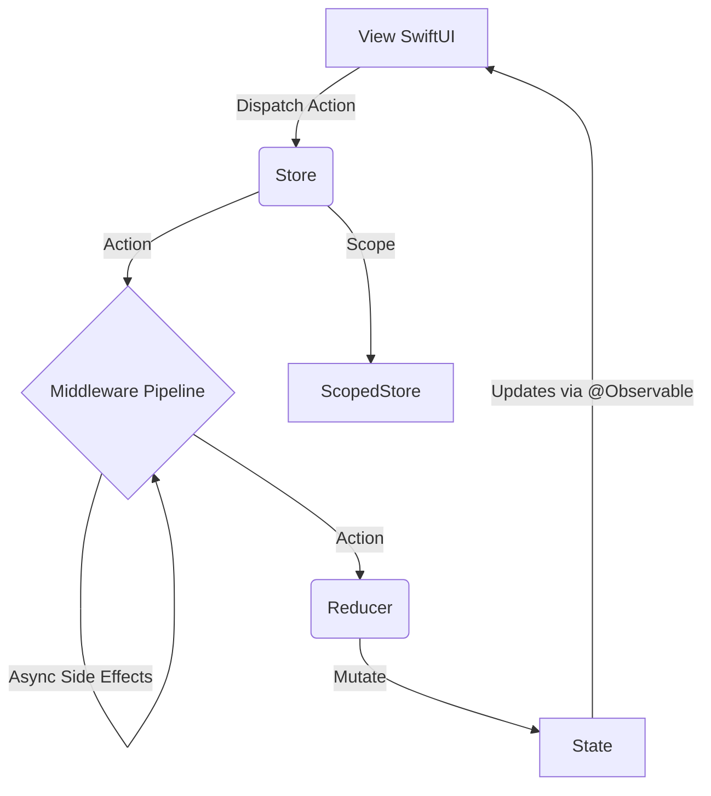

# TGReduxKit

TGReduxKit 是一个专为 SwiftUI (iOS 17+) 设计的轻量级 Redux 状态管理框架，基于 Swift Observation 提供响应式更新，并保持比 TCA 更低的心智负担。

## 架构设计



## 核心概念

- **Store**: `@MainActor` 单一数据源，持有根 State。
- **ScopedStore**: 面向 Feature 的子 Store，只暴露局部 State 和 Action。
- **StoreType**: `Store` / `ScopedStore` 共享的最小协议面，统一 `state`、`dispatch` 和 SwiftUI `binding` 接口。
- **Root-only Async**: `runTask` / `debounce` / `throttle` / retry / timeout 仅由 root `Store` 持有；`ScopedStore` 保持同步 View API，不独立管理任务生命周期。
- **Action**: 描述发生的事件。
- **Reducer**: 主 actor 上的纯函数，`@MainActor (inout State, Action) -> Void`，负责更新 State。
- **Middleware**: 运行在主线程的同步中间件，用于处理副作用入口。
- **CancellationID**: 用于取消同类异步任务的轻量标识。

## 快速开始

### 1. 定义 State 和 Action

```swift
struct AppState {
    var count: Int = 0
    var message: String = ""
}

enum AppAction {
    case increment
    case decrement
    case updateMessage(String)
}
```

### 2. 定义 Reducer

```swift
let appReducer: Reducer<AppState, AppAction> = { state, action in
    switch action {
    case .increment:
        state.count += 1
    case .decrement:
        state.count -= 1
    case .updateMessage(let msg):
        state.message = msg
    }
}
```

### 3. 创建 Middleware (可选)

```swift
let loggingMiddleware: Middleware<AppState, AppAction> = { store, action, next in
    print("Dispatched: \(action)")
    next(action)
}
```

### 4. 初始化 Store 并注入

```swift
@main
struct MyApp: App {
    @State private var store = Store(
        initialState: AppState(),
        reducer: appReducer,
        middlewares: [loggingMiddleware]
    )

    var body: some Scene {
        WindowGroup {
            ContentView()
                .provideStore(store)
        }
    }
}
```

### 5. 在 View 中使用

```swift
struct ContentView: View {
    @Environment(Store<AppState, AppAction>.self) var store

    var body: some View {
        VStack {
            Text("Count: \(store.state.count)")

            HStack {
                Button("-") { store.dispatch(.decrement) }
                Button("+") { store.dispatch(.increment) }
            }

            TextField("Message", text: store.binding(
                get: \.message,
                send: { .updateMessage($0) }
            ))
        }
    }
}
```

如果你使用 SwiftUI 导航适配层 `TGNavigationStack`，请额外导入独立 target：

```swift
import TGReduxKitNavigation
```

## StoreType 与异步边界

`StoreType` 统一的是 **View 层最小公共面**：

- `state`
- `dispatch(_:)`
- SwiftUI `binding(get:send:)`
- `.provideStore(_:)`

异步副作用与任务生命周期管理仍然属于 **root `Store`**：

- `runTask`
- `cancelTask` / `cancelAllTasks`
- `debounce`
- `throttle`
- retry / timeout / `catching`

这意味着：Feature View 可以无差别依赖 `StoreType`，但需要启动异步副作用时，应该回到 root store 的 middleware / 协调层，而不是让 `ScopedStore` 自己持有一套任务注册表。

## 文档索引

完整文档入口见 [Docs/README.md](Docs/README.md)。快速分层如下：

| 分类 | 入口 |
|------|------|
| 接入与使用 | [Docs/README.md#接入指南](Docs/README.md#接入指南) |
| 架构分析 | [Docs/README.md#架构分析](Docs/README.md#架构分析) |
| 审阅与维护 | [Docs/README.md#审阅与维护](Docs/README.md#审阅与维护) |

## 最佳实践

1. **State 设计**: 根状态只承担聚合职责，Feature 细节通过 scoped store 暴露。
2. **Action 命名**: 描述"发生了什么"，不要描述"打算怎么做"。
3. **Reducer 约束**: reducer 只做状态变换，不做网络请求、日志和任务启动。
4. **并发策略**: 所有状态读写和 dispatch 都收敛到 `@MainActor`。
5. **异步控制**: 同类任务优先使用 `CancellationID` 管理取消，并把任务启动留在 root store / middleware。
6. **依赖注入边界**: 不把 DI 容器塞进 Store，优先注入协议化依赖或 middleware builder 参数。
7. **Feature Flag 边界**: 让 flag SDK 留在基础设施层，把 flag 结果映射为显式状态，而不是在 View 中直接查询。

## 文档生成

在 Xcode 中打开 Package，选择 `Product` -> `Build Documentation` 即可生成 DocC 文档。
