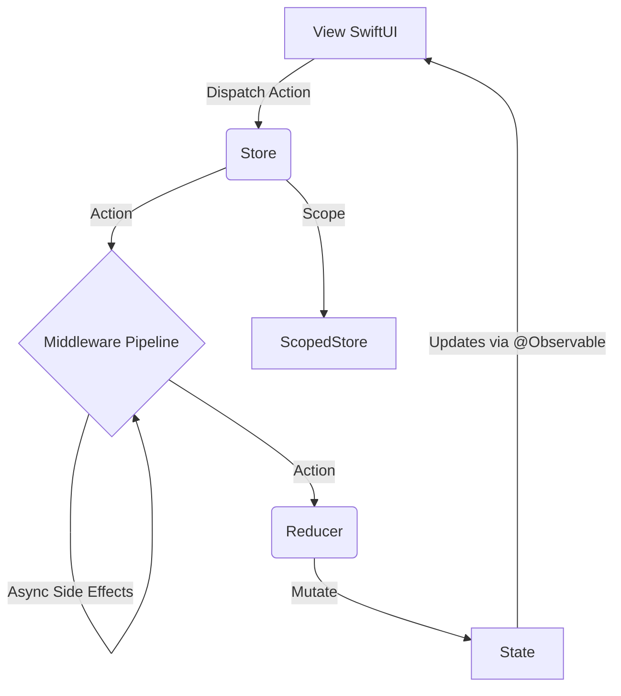

# TGReduxKit

TGReduxKit 是一个专为 SwiftUI (iOS 17+) 设计的轻量级 Redux 状态管理框架，基于 Swift Observation 提供响应式更新，并保持比 TCA 更低的心智负担。

## 架构设计



## 核心概念

- **Store**: `@MainActor` 单一数据源，持有根 State。
- **ScopedStore**: 面向 Feature 的子 Store，只暴露局部 State 和 Action。
- **Action**: 描述发生的事件。
- **Reducer**: 纯函数，`(inout State, Action) -> Void`，负责更新 State。
- **Middleware**: 运行在主线程的同步中间件，用于处理副作用入口。
- **CancellationID**: 用于取消同类异步任务的轻量标识。

## 快速开始

### 1. 定义 State 和 Action

```swift
struct AppState {
    var count: Int = 0
    var message: String = ""
}

enum AppAction {
    case increment
    case decrement
    case updateMessage(String)
}
```

### 2. 定义 Reducer

```swift
let appReducer: Reducer<AppState, AppAction> = { state, action in
    switch action {
    case .increment:
        state.count += 1
    case .decrement:
        state.count -= 1
    case .updateMessage(let msg):
        state.message = msg
    }
}
```

### 3. 创建 Middleware (可选)

```swift
let loggingMiddleware: Middleware<AppState, AppAction> = { store, action, next in
    print("Dispatched: \(action)")
    next(action)
}
```

### 4. 初始化 Store 并注入

```swift
@main
struct MyApp: App {
    @State private var store = Store(
        initialState: AppState(),
        reducer: appReducer,
        middlewares: [loggingMiddleware]
    )

    var body: some Scene {
        WindowGroup {
            ContentView()
                .provideStore(store)
        }
    }
}
```

### 5. 在 View 中使用

```swift
struct ContentView: View {
    @Environment(Store<AppState, AppAction>.self) var store

    var body: some View {
        VStack {
            Text("Count: \(store.state.count)")

            HStack {
                Button("-") { store.dispatch(.decrement) }
                Button("+") { store.dispatch(.increment) }
            }

            TextField("Message", text: store.binding(
                get: \.message,
                send: { .updateMessage($0) }
            ))
        }
    }
}
```

## 文档索引

快速开始后，按需查看对应文档：

| 文档 | 说明 |
|------|------|
| [高级用法](Docs/ADVANCED_USAGE.md) | Scoped Store、异步操作、debounce/throttle/retry/timeout、TestStore、调试中间件、时间旅行、DI 协作、Feature Flag 协作 |
| [模块化 Reducer](Docs/REDUCER_COMPOSITION.md) | `combineReducers` + `pullback` 组合式写法、子 Reducer 边界、cross-cutting reducer |
| [跨 Feature 通信](Docs/CROSS_FEATURE_COMMUNICATION.md) | 三种跨 Feature 通信模式及适用场景 |
| [错误处理](Docs/ERROR_HANDLING.md) | `runTask(catching:)` 业务错误恢复 + `errorReportingMiddleware` 全局上报 |
| [测试指南](Docs/TESTING_GUIDE.md) | 三层测试策略（纯 Reducer / Middleware 单测 / 集成冒烟）、速度对比 |
| [多 Feature 联动实战](Docs/MULTI_FEATURE_GUIDE.md) | 购物 App + 车载 App 完整场景 |
| [时间旅行调试](Docs/TIME_TRAVEL_GUIDE.md) | `TimeTravelRecorder` + `TimelineInspector` 使用指南 |
| [Feature Flag 集成](Docs/FEATURE_FLAG_GUIDE.md) | Demo 中的 Feature Flag 架构设计与落地方案 |
| [架构与异步流分析](Docs/ASYNC_FLOW_ANALYSIS.md) | 源码架构分析与异步流处理详解 |
| [异步竞态与任务取消](Docs/ASYNC_RACE_AND_CANCELLATION.md) | 问题 A/B：多个不确定异步答案、latest-wins 与生命周期取消 |
| [为什么转向 Redux](Docs/WHY_REDUX_ADOPTION.md) | 设计思路、选型对比与团队内采纳 / 说服指南 |
| [框架分析报告](Docs/ANALYSIS_AND_GUIDE.md) | 框架能力边界分析与分阶段改进方案 |

## 最佳实践

1. **State 设计**: 根状态只承担聚合职责，Feature 细节通过 scoped store 暴露。
2. **Action 命名**: 描述"发生了什么"，不要描述"打算怎么做"。
3. **Reducer 约束**: reducer 只做状态变换，不做网络请求、日志和任务启动。
4. **并发策略**: 所有状态读写和 dispatch 都收敛到 `@MainActor`。
5. **异步控制**: 同类任务优先使用 `CancellationID` 管理取消。
6. **依赖注入边界**: 不把 DI 容器塞进 Store，优先注入协议化依赖或 middleware builder 参数。
7. **Feature Flag 边界**: 让 flag SDK 留在基础设施层，把 flag 结果映射为显式状态，而不是在 View 中直接查询。

## 文档生成

在 Xcode 中打开 Package，选择 `Product` -> `Build Documentation` 即可生成 DocC 文档。
