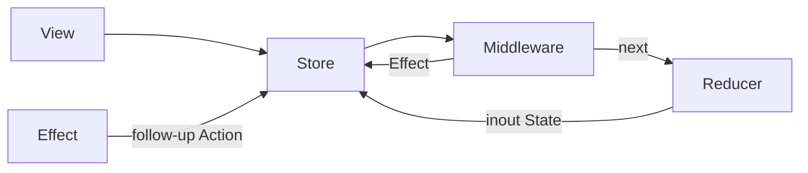

# TGReduxKit

轻量 Redux for SwiftUI（iOS 17+）— **5.0**

**纯 Reducer（`Void`）+ Middleware → `Effect` + `@MainActor @Observable` `Store`**

领域 `State` / `Action` / `Reducer` 保持非隔离纯函数；副作用与依赖只在 Middleware 边界注入（无 DI 容器）。

## 架构



| Product | 职责 |
|---------|------|
| `TGReduxKitCore` | `State` / `Action` / 纯 `Reducer` / `Effect` / `CancellationID` |
| `TGReduxKitRuntime` | `@MainActor` `Store`、Middleware→Effect、`ScopedStore` |
| `TGReduxKitUI` | `provideStore` / `binding` |
| `TGReduxKitDebug` | logging / state-diff / error-reporting |
| `TGReduxKitTesting` | `TestStore`（纯 Reducer） |
| `TGReduxKit` | Umbrella（Core+Runtime+UI+Debug） |

- 架构：[ARCHITECTURE.md](ARCHITECTURE.md) · [Docs/ADR_AUDITED_MIDDLEWARE_EFFECT.md](Docs/ADR_AUDITED_MIDDLEWARE_EFFECT.md)
- DI：[Docs/DEPENDENCY_INJECTION.md](Docs/DEPENDENCY_INJECTION.md)

## 快速开始

```swift
import TGReduxKit

struct AppState: Equatable, Sendable, State { var count = 0 }
enum AppAction: Sendable, Action { case increment, load, loaded(Int) }

let reducer: Reducer<AppState, AppAction> = { state, action in
    switch action {
    case .increment: state.count += 1
    case .loaded(let value): state.count = value
    case .load: break
    }
}

func makeLoadMiddleware(fetch: @escaping @Sendable () async -> Int) -> Middleware<AppState, AppAction> {
    { _, action, next in
        let base = next(action)
        guard case .load = action else { return base }
        return .merge(base, .task { .loaded(await fetch()) })
    }
}

// Composition Root
@SwiftUI.State var store = Store(
    initialState: AppState(),
    reducer: reducer,
    middlewares: [makeLoadMiddleware(fetch: { 42 })]
)
```

## 安装

```swift
.package(url: "https://github.com/tangzzz-fan/TGReduxKit", from: "5.0.0"),
```

```swift
.product(name: "TGReduxKit", package: "TGReduxKit")
```

## 文档

| 文档 | 说明 |
|------|------|
| [Docs/README.md](Docs/README.md) | 索引（仅现行 5.0） |
| [Docs/MIGRATION_4_TO_5.md](Docs/MIGRATION_4_TO_5.md) | 4.x → 5.0 |
| [Docs/EFFECT_GUIDE.md](Docs/EFFECT_GUIDE.md) | Effect / 取消 / 竞态 |
| [CHANGELOG.md](CHANGELOG.md) | 版本记录 |

## 要求

- Swift 6.0+
- iOS 17 / macOS 14 / tvOS 17 / watchOS 10

## License

MIT
