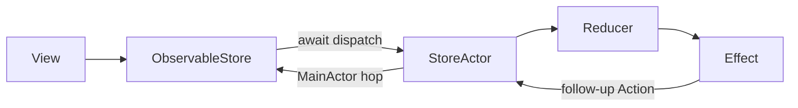

# TGReduxKit

轻量 Redux for SwiftUI（iOS 17+），Swift 6 三角架构：

**领域纯函数（非隔离） + `actor` 状态容器 + Effect 副作用**

框架扛起隔离责任；业务 `State` / `Action` / `Reducer` 无需标注 `nonisolated`。

## 架构



| Product | 职责 |
|---------|------|
| `TGReduxKitCore` | `Reducer`、`Effect`、`DependencyContext`、组合器 |
| `TGReduxKitRuntime` | `actor Store`、Effect 调度 |
| `TGReduxKitUI` | `ObservableStore`、SwiftUI 注入 |
| `TGReduxKitTesting` | `TestStore` |
| `TGReduxKit` | Umbrella re-export（Core+Runtime+UI） |

详见 [Docs/ADR_TRIANGULAR_ARCHITECTURE.md](Docs/ADR_TRIANGULAR_ARCHITECTURE.md)。

## 快速开始

```swift
import TGReduxKit

struct AppState: Sendable { var count = 0 }
enum AppAction: Sendable { case increment, saved }

let reducer = Reducer<AppState, AppAction> { state, action, _ in
    switch action {
    case .increment:
        state.count += 1
        return .run {
            try await Task.sleep(for: .milliseconds(100))
            return .saved
        }
    case .saved:
        return .none
    }
}

// SwiftUI
@State var store = ObservableStore(initialState: AppState(), reducer: reducer)
// store.dispatch(.increment)
```

## 安装

```swift
.package(url: "https://github.com/tangzzz-fan/TGReduxKit", from: "5.0.0"),
```

```swift
dependencies: [
  .product(name: "TGReduxKit", package: "TGReduxKit")
]
```

## 从 4.x 迁移

见 [Docs/MIGRATION_4_TO_5.md](Docs/MIGRATION_4_TO_5.md)。

## 文档

- [Docs/README.md](Docs/README.md) — 文档索引
- [Docs/ADR_TRIANGULAR_ARCHITECTURE.md](Docs/ADR_TRIANGULAR_ARCHITECTURE.md)
- [CHANGELOG.md](CHANGELOG.md)

## 要求

- Swift 6.0+
- iOS 17 / macOS 14 / tvOS 17 / watchOS 10

## License

MIT
