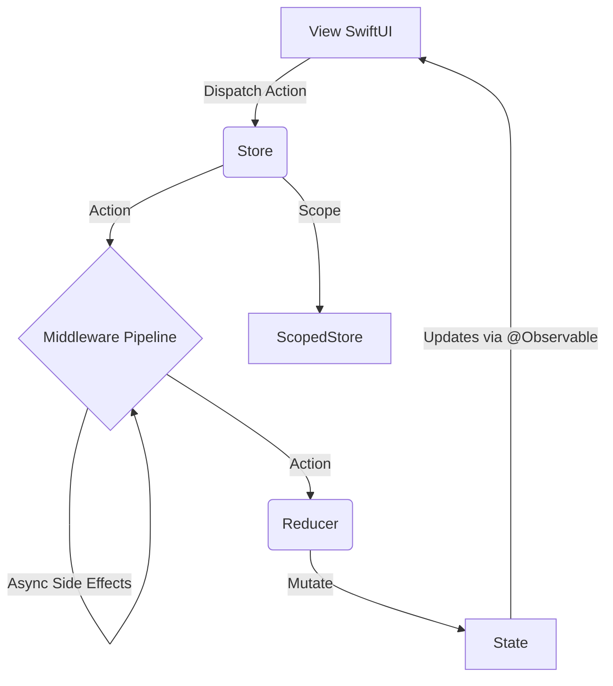

# TGReduxKit

TGReduxKit 是一个专为 SwiftUI (iOS 17+) 设计的轻量级 Redux 状态管理框架，基于 Swift Observation 提供响应式更新，并保持比 TCA 更低的心智负担。

## 架构设计



## 核心概念

- **Store**: `@MainActor` 单一数据源，持有根 State。
- **ScopedStore**: 面向 Feature 的子 Store，只暴露局部 State 和 Action。
- **Action**: 描述发生的事件。
- **Reducer**: 纯函数，`(inout State, Action) -> Void`，负责更新 State。
- **Middleware**: 运行在主线程的同步中间件，用于处理副作用入口。
- **CancellationID**: 用于取消同类异步任务的轻量标识。

## 快速开始

### 1. 定义 State 和 Action

```swift
struct AppState {
    var count: Int = 0
    var message: String = ""
}

enum AppAction {
    case increment
    case decrement
    case updateMessage(String)
}
```

### 2. 定义 Reducer

```swift
let appReducer: Reducer<AppState, AppAction> = { state, action in
    switch action {
    case .increment:
        state.count += 1
    case .decrement:
        state.count -= 1
    case .updateMessage(let msg):
        state.message = msg
    }
}
```

### 3. 创建 Middleware (可选)

```swift
let loggingMiddleware: Middleware<AppState, AppAction> = { store, action, next in
    print("Dispatched: \(action)")
    next(action)
}
```

### 4. 初始化 Store 并注入

```swift
@main
struct MyApp: App {
    @State private var store = Store(
        initialState: AppState(),
        reducer: appReducer,
        middlewares: [loggingMiddleware]
    )

    var body: some Scene {
        WindowGroup {
            ContentView()
                .provideStore(store) // 使用辅助方法注入
        }
    }
}
```

### 5. 在 View 中使用

```swift
struct ContentView: View {
    @Environment(Store<AppState, AppAction>.self) var store

    var body: some View {
        VStack {
            Text("Count: \(store.state.count)")

            HStack {
                Button("-") { store.dispatch(.decrement) }
                Button("+") { store.dispatch(.increment) }
            }

            TextField("Message", text: store.binding(
                get: \.message,
                send: { .updateMessage($0) }
            ))
        }
    }
}
```

## 高级用法

### 1. Scoped Store

```swift
struct ProfileState {
    var name = ""
}

struct AppState {
    var profile = ProfileState()
}

enum ProfileAction {
    case updateName(String)
}

enum AppAction {
    case profile(ProfileAction)
}

let profileStore = store.scope(
    state: \.profile,
    action: AppAction.profile
)
```

子视图可以只依赖 `ScopedStore<ProfileState, ProfileAction>`，避免直接耦合根状态树。

### 2. 处理异步操作

Reducer 必须保持纯净，副作用应在 **Middleware** 中处理。

```swift
enum AppAction {
    case fetchUser
    case userLoaded(String)
    case loading(Bool)
}

let apiMiddleware: Middleware<AppState, AppAction> = { store, action, next in
    next(action)

    if case .fetchUser = action {
        store.runTask(id: "fetch-user") {
            await store.dispatch(.loading(true))
            try? await Task.sleep(nanoseconds: 1_000_000_000)

            guard !Task.isCancelled else { return }

            let user = "User-" + String(Int.random(in: 1...100))
            await store.dispatch(.userLoaded(user))
            await store.dispatch(.loading(false))
        }
    }
}
```

### 3. 声明式异步原语

TGReduxKit 提供了防抖、节流、重试、超时等声明式原语：

**Debounce（防抖）** — 适合搜索框输入：

```swift
store.debounce(id: "search", milliseconds: 300) {
    let results = await searchService.search(query)
    guard !Task.isCancelled else { return }
    await store.dispatch(.searchCompleted(results))
}
```

**Throttle（节流）** — 适合滚动追踪、快速点击：

```swift
store.throttle(id: "scroll-track", milliseconds: 200) {
    await store.dispatch(.trackPosition(position))
}
```

**Retry（重试）** — 自动重试失败的请求：

```swift
store.runTask(id: "sync", maxRetries: 3, backoff: .exponential(baseMs: 200)) {
    let data = try await api.fetchData()
    await store.dispatch(.dataLoaded(data))
}
```

**Timeout（超时）** — 超时后自动 fallback：

```swift
store.runTask(id: "fetch", timeoutMs: 5_000, fallback: { .fetchFailed(.timeout) }) {
    let data = await api.fetchData()
    guard !Task.isCancelled else { return }
    await store.dispatch(.dataLoaded(data))
}
```

### 4. 取消同类旧任务

```swift
store.runTask(id: "search") {
    try? await Task.sleep(nanoseconds: 300_000_000)
    guard !Task.isCancelled else { return }
    await store.dispatch(.performSearch)
}

store.cancelTask(id: "search")
```

### 5. 使用 TestStore 测试 Reducer

`TestStore` 是纯 reducer 的同步测试工具，不需要运行 App 或等待异步操作：

```swift
import Testing
@testable import TGReduxKit

@Test func counterFlow() {
    let store = TestStore(initialState: CounterState(), reducer: counterReducer)

    // send + expect 合并断言
    store.send(.increment, expect: CounterState(count: 1))

    // 逐步 send + assert
    store.send(.increment)
    store.send(.decrement)
    store.assert(equals: CounterState(count: 1))

    // 自定义 predicate 断言
    store.send(.setMessage("Done"))
    store.assert("state should match") { state in
        state.count == 1 && state.message == "Done"
    }

    // 检查完整状态历史
    let history = store.replayHistory()
    #expect(history.count == 4) // 初始状态 + 3 次 send
}
```

### 6. 模块化 Reducer（组合式）

使用 `combineReducers` 和 `pullback` 将 Feature reducer 组合为根 reducer：

```swift
struct AppState {
    var counter: CounterState
    var user: UserState
}

let appReducer: Reducer<AppState, AppAction> = combineReducers(
    pullback(counterReducer,
        state: \.counter,
        extract: { if case .counter(let a) = $0 { a } else { nil } }
    ),
    pullback(userReducer,
        state: \.user,
        extract: { if case .user(let a) = $0 { a } else { nil } }
    )
)
```

`pullback` 将子 reducer 从 `(ChildState, ChildAction)` 提升为 `(ParentState, ParentAction)`，只在 extract 返回非 nil 时运行。`combineReducers` 按声明顺序执行所有子 reducer。**每个 Feature 一条线，新增模块只加一行。**

注：也可以继续使用手写 switch 的方式——两种写法完全等价。组合式在 Feature 数量 ≥3 时更清晰。

### 6.1 为什么需要 pullback：子 Reducer 的边界

`pullback` 不是简单的语法糖——它强制了**关注点分离**。以下场景来自 Demo 的 `Redux.swift`（见 `Examples/TGReduxKitDemo`）。

**子 Reducer 能做的事（独立模块，纯状态变换）：**

```swift
// catalogReducer 只操作 CatalogState——不接触 CartState 或 FeatureFlagsState
let catalogReducer: Reducer<CatalogState, CatalogAction> = { state, action in
    switch action {
    case .searchQueryChanged(let query):
        state.searchQuery = query            // ✅ 操作自己的字段
        state.isSearching = !query.isEmpty   // ✅
    case .searchCompleted:
        state.isSearching = false            // ✅
    }
}
```

**子 Reducer 做不到的事（需要父级介入）：**

> 子 Reducer 的 State 类型是 `CatalogState`，它**看不到**父级的 `FeatureFlagsState.snapshot`。因此 Feature Flag 刷新后，子 Reducer 无法更新 `CatalogState.showsFreeShippingBanner` 这类派生展示字段。

这些逻辑应该放在一个**父级 cross-cutting reducer** 中：

```swift
// crossCuttingReducer：处理子 Reducer 边界之外的三类事情
let crossCuttingReducer: Reducer<ShoppingState, ShoppingAction> = { state, action in
    switch action {
    case .featureFlags(.loaded(let snapshot, _)):
        // 1️⃣ Flag → 派生展示字段映射（子 Reducer 不持有 snapshot）
        state.catalog.showsFreeShippingBanner = snapshot.showsFreeShippingBanner
        state.catalog.showsRecommendedBadge = snapshot.showsRecommendedBadge
        state.isExpressCheckoutAvailable = snapshot.isExpressCheckoutEnabled   // 顶层字段

    case .navigation(let navAction):
        // 2️⃣ 路由（直接操作根 State 的 navigation 字段）
        navigationReducer(state: &state.navigation, action: navAction)

    case .handleDeepLink(let url):
        // 3️⃣ Deep Link（需要跨多个子 State 查找/组装数据）
        if let product = state.product(for: productID) { ... }
    }
}

// 组装
let shoppingReducer = combineReducers(
    pullback(catalogReducer, ...),
    pullback(cartReducer, ...),
    pullback(featureFlagsReducer, ...),
    crossCuttingReducer    // ← 处理子 Reducer 边界之外的事
)
```

**三种职责的分工：**

| | 子 Reducer（pullback 包装） | 父级 cross-cutting reducer |
|---|---|---|
| 操作对象 | 只操作自己的 ChildState | 可读写任意子状态 + 根级字段 |
| 适合处理 | 单 Feature 内的纯状态变换 | 多 Feature 联动、路由、派生映射 |
| 编译期约束 | extract 返回 nil 时不执行 | 所有 Action 都会收到 |
| 新增模块 | 加一行 `pullback(...)` | 不改 crossCuttingReducer |

完整的 Demo 代码见 `Examples/TGReduxKitDemo/TGReduxKitDemo/Redux.swift`。

### 7. 调试中间件

```swift
let store = Store(
    initialState: AppState(),
    reducer: appReducer,
    middlewares: [
        actionLoggingMiddleware(),
        stateDiffMiddleware()
    ]
)
```

### 8. 与依赖注入容器协作

TGReduxKit 不需要内建 DI 容器。更合适的方式是让 Factory、Swinject、Resolver 一类容器在框架外解析依赖，再把依赖传入 middleware 工厂。

```swift
protocol UserRepository: Sendable {
    func fetchUser() async throws -> User
}

struct AppDependencies: Sendable {
    var userRepository: any UserRepository
}

func makeUserMiddleware(
    dependencies: AppDependencies
) -> Middleware<AppState, AppAction> {
    { store, action, next in
        next(action)

        guard case .loadUser = action else { return }

        store.runTask(id: "load-user") {
            guard let user = try? await dependencies.userRepository.fetchUser() else {
                return
            }

            await store.dispatch(.userLoaded(user))
        }
    }
}

let dependencies = AppDependencies(
    userRepository: container.userRepository()
)

let store = Store(
    initialState: AppState(),
    reducer: appReducer,
    middlewares: [
        makeUserMiddleware(dependencies: dependencies)
    ]
)
```

这种模式把职责分得很清楚：

- TGReduxKit 负责状态流、作用域和副作用生命周期。
- DI 容器负责解析 service、repository、client。
- View 和 reducer 不直接依赖具体容器实现。

### 9. 与 Feature Flag 库协作

Feature Flag 更适合作为依赖源，而不是 Store 内建能力。推荐做法是由 Feature Flag SDK 或封装服务提供 flag 快照，再通过 middleware 或应用启动流程把结果转换成普通 action。

```swift
protocol FeatureFlagServicing: Sendable {
    func boolValue(for key: String) async -> Bool
}

struct AppState {
    var flags = FlagsState()
}

struct FlagsState {
    var isNewCheckoutEnabled = false
}

enum AppAction {
    case appLaunched
    case flagsLoaded(isNewCheckoutEnabled: Bool)
}

func makeFeatureFlagMiddleware(
    featureFlags: any FeatureFlagServicing
) -> Middleware<AppState, AppAction> {
    { store, action, next in
        next(action)

        guard case .appLaunched = action else { return }

        store.runTask(id: "load-feature-flags") {
            let isNewCheckoutEnabled = await featureFlags.boolValue(for: "new_checkout")
            await store.dispatch(
                .flagsLoaded(isNewCheckoutEnabled: isNewCheckoutEnabled)
            )
        }
    }
}
```

推荐的职责边界：

- Feature Flag 库负责远端拉取、缓存和分流规则。
- TGReduxKit 负责把 flag 结果转换成可追踪的状态与 action。
- 配置看板类 View 可以读取 `FeatureFlagsState`，业务 View 更推荐读取 reducer 映射后的派生展示状态。
- Demo 中的完整落地方案见 `TGREDUXKIT_FEATUREFLAG_DEMO_GUIDE.md`。

常见结合方式：

- **启动期预加载**：App 启动后拉取 flag，驱动首页模块开关。
- **按模块注入**：把某个 feature 的 flag service 注入对应 middleware builder。
- **实验治理**：将实验分组结果写入 state，配合 analytics middleware 统一上报。
- **降级保护**：远端关闭某个高风险功能时，通过 action 立即收敛到稳定 UI。

## 最佳实践

1. **State 设计**: 根状态只承担聚合职责，Feature 细节通过 scoped store 暴露。
2. **Action 命名**: 描述“发生了什么”，不要描述“打算怎么做”。
3. **Reducer 约束**: reducer 只做状态变换，不做网络请求、日志和任务启动。
4. **并发策略**: 所有状态读写和 dispatch 都收敛到 `@MainActor`。
5. **异步控制**: 同类任务优先使用 `CancellationID` 管理取消。
6. **依赖注入边界**: 不把 DI 容器塞进 Store，优先注入协议化依赖或 middleware builder 参数。
7. **Feature Flag 边界**: 让 flag SDK 留在基础设施层，把 flag 结果映射为显式状态，而不是在 View 中直接查询。

## 跨 Feature 通信

当 Feature A（如购物车）的变化需要触发 Feature B（如推荐）的副作用时，有几种模式可选。

### 模式一：父级 Middleware 转发（推荐）

在根 Store 的 middleware 数组中放置一个"协调 middleware"，监听跨 Feature 事件：

```swift
let crossFeatureMiddleware: Middleware<ShoppingState, ShoppingAction> = { store, action, next in
    next(action)

    // Feature A 的事件 → 触发 Feature B 的副作用
    if case .cart(.add(let product)) = action {
        store.runTask(id: "refresh-recommendations") {
            let recommendations = await recService.recommendations(basedOn: product)
            await store.dispatch(.recommendations(.updated(recommendations)))
        }
    }
}

let store = Store(
    initialState: ShoppingState(),
    reducer: shoppingReducer,
    middlewares: [
        // 先注册 Feature 专用 middleware
        makeProductSearchMiddleware(dependencies: deps),
        cartMiddleware,
        // 最后注册跨 Feature 协调 middleware
        crossFeatureMiddleware,
    ]
)
```

**适用场景**：Feature A 触发 Feature B 的副作用（如加购后刷新推荐）。

### 模式二：Reducer 内联联动

如果 Feature B 只需要**同步**更新派生状态，直接在 reducer 中处理——不需要 middleware：

```swift
let shoppingReducer: Reducer<ShoppingState, ShoppingAction> = { state, action in
    switch action {
    case .cart(.add(let product)):
        // Feature A 自己的状态更新
        if let index = state.cart.items.firstIndex(where: { $0.product.id == product.id }) {
            state.cart.items[index].quantity += 1
        } else {
            state.cart.items.append(CartItem(product: product))
        }
        // Feature B 的派生状态同步更新
        state.recommendations.lastAddedProductID = product.id

    // ...其他 case
    }
}
```

**适用场景**：Feature B 只需要同步读取 Feature A 的状态变化结果。

### 模式三：Action 嵌套（编译期约束）

通过 `ScopedStore` 的 action 映射，子 Feature 天然只能发自己的 action，无法"不小心"影响兄弟 Feature。如果确需跨 Feature，必须在父级定义显式的转发 action：

```swift
enum ShoppingAction: Equatable {
    case catalog(CatalogAction)
    case cart(CartAction)
    case recommendations(RecommendationsAction)
    // 显式的跨 Feature 协调 action
    case cartDidUpdate(lastAddedProduct: Product)
}
```

**适用场景**：需要编译期强约束，所有跨 Feature 行为都在父级显式声明。

### 推荐组合

| 场景 | 推荐模式 |
|------|---------|
| A 事件 → B 异步副作用 | 模式一（父级 middleware） |
| A 状态变化 → B 同步派生 | 模式二（reducer 内联） |
| 大型团队、需编译期约束 | 模式三（显式协调 action） |

## 错误处理指南

### 模式一：Middleware 内 catch → dispatch 错误 Action

直接在 middleware 的 `runTask(catching:)` 中将错误转为 action：

```swift
let userMiddleware: Middleware<AppState, AppAction> = { store, action, next in
    next(action)

    guard case .loadUser = action else { return }

    store.runTask(id: "load-user", catching: { error in
        .user(.loadFailed(error.localizedDescription))
    }) {
        let user = try await userRepository.fetchUser()
        await store.dispatch(.user(.loaded(user)))
    }
}
```

### 模式二：全局错误上报

使用 `errorReportingMiddleware` 将所有匹配的错误 action 上报到日志/分析服务：

```swift
let store = Store(
    initialState: AppState(),
    reducer: appReducer,
    middlewares: [
        // Feature middleware...
        errorReportingMiddleware(
            extract: { action in
                if case .user(.loadFailed(let msg)) = action {
                    return (NSError(domain: "App", code: 0, userInfo: [NSLocalizedDescriptionKey: msg]), "user")
                }
                if case .catalog(.searchFailed(let msg)) = action {
                    return (NSError(domain: "App", code: 0, userInfo: [NSLocalizedDescriptionKey: msg]), "catalog")
                }
                return nil
            },
            reporter: { error, source in
                CrashReporter.log(error, source: source)
            }
        ),
    ]
)
```

### 推荐组合

| 场景 | 推荐 |
|------|------|
| 业务错误恢复 | 模式一（`runTask(catching:)` — 错误回流为 action） |
| 全局日志/监控 | 模式二（`errorReportingMiddleware` — 拦截上报） |
| 两者都需要 | 叠加使用：先 catching 回流，再 middleware 上报 |

## 测试指南

使用 TGReduxKit 时，业务代码有三层可测试的粒度，推荐按 **80 / 15 / 5** 的比例分配：

### 第一层：纯 Reducer 测试（主力，~80%）

用 `TestStore` 同步测试状态机逻辑——不需要 App、不需要 middleware、不需要异步等待。

```swift
import Testing
@testable import YourApp

@Test func searchFlow() {
    let store = TestStore(initialState: CatalogState(), reducer: catalogReducer)

    // 用户输入 → 进入搜索态
    store.send(.searchQueryChanged("iPhone"))
    #expect(store.state.isSearching == true)

    // 结果返回 → 退出搜索态
    store.send(.searchCompleted("iPhone", [iphoneProduct]))
    #expect(store.state.isSearching == false)
    #expect(store.state.visibleProducts.count == 1)

    // 清空 → 重置
    store.send(.searchQueryChanged(""))
    #expect(store.state.isSearching == false)
    #expect(store.state.visibleProducts.isEmpty == false)
}
```

这一层覆盖了所有状态转移路径——bug 最常见的地方。

### 第二层：Middleware 单元测试（补充，~15%）

Middleware 是闭包，可以构造 Store + mock 依赖来直接测试，不需要启动 App：

```swift
@Test func searchDebounceCancelsPreviousTask() async throws {
    let mockService = MockSearchService()
    let deps = ShoppingDependencies(productSearchService: mockService)

    let store = Store(
        initialState: ShoppingState(),
        reducer: shoppingReducer,
        middlewares: [makeProductSearchMiddleware(dependencies: deps)]
    )

    // 快速连续输入 3 次
    store.dispatch(.catalog(.searchQueryChanged("i")))
    store.dispatch(.catalog(.searchQueryChanged("ip")))
    store.dispatch(.catalog(.searchQueryChanged("iph")))

    // 防抖期间，搜索尚未触发
    #expect(mockService.callCount == 0)

    // 等待 debounce（300ms）
    try await Task.sleep(nanoseconds: 400_000_000)

    // 只触发一次，且使用最终 query
    #expect(mockService.callCount == 1)
    #expect(mockService.lastQuery == "iph")
}
```

关键技巧：把网络、数据库等外部依赖**协议化**，在测试中注入 mock。这与 Demo 中 `ShoppingDependencies` 的设计一致。

### 第三层：集成冒烟测试（少量，~5%）

把 middleware + reducer 串联，验证关键业务流程的端到端状态流转：

```swift
@Test func fullSearchAndAddToCart() async throws {
    let store = Store(
        initialState: ShoppingState(),
        reducer: shoppingReducer,
        middlewares: [makeProductSearchMiddleware(dependencies: .test)]
    )

    store.dispatch(.catalog(.searchQueryChanged("MacBook")))
    try await Task.sleep(nanoseconds: 400_000_000)

    // 搜索结果正确
    #expect(store.state.catalog.visibleProducts.count == 1)

    // 加入购物车后的状态
    store.dispatch(.cart(.add(store.state.catalog.visibleProducts[0])))
    #expect(store.state.cart.totalQuantity == 1)
    #expect(store.state.cart.totalPrice == 1999)
}
```

### 速度对比

| 层级 | 单次耗时 | 依赖 | 适合测什么 |
|------|---------|------|-----------|
| TestStore（纯 reducer） | 微秒级 | 无 | 状态机逻辑 |
| Middleware 单测 | 毫秒级 | Mock 协议 | 副作用编排（debounce、重试） |
| 集成测试 | 百毫秒级 | Mock + sleep | 关键流程冒烟 |

## 文档生成

本项目包含完整的 API 文档注释。你可以使用 Swift-DocC 生成文档。

### 在 Xcode 中查看
在 Xcode 中打开 Package，选择 `Product` -> `Build Documentation`。

### 命令行生成
```bash
swift package generate-documentation --target TGReduxKit
```

生成的文档通常位于 `.build/plugins/Swift-DocC/outputs` 目录下（具体取决于 Swift 版本和平台）。
