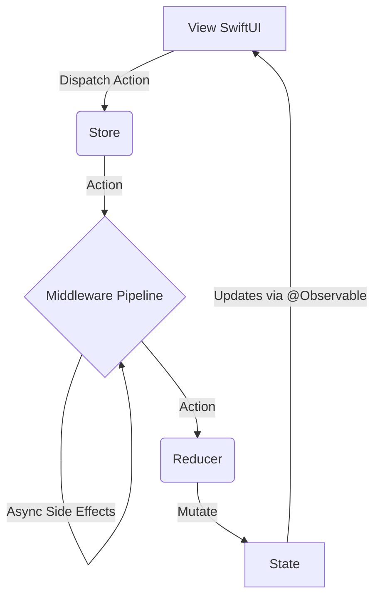

# TGReduxKit

TGReduxKit 是一个专为 SwiftUI (iOS 17+) 设计的轻量级、高性能 Redux 状态管理框架。利用 Swift Observation 框架实现响应式更新。

## 架构设计



## 核心概念

- **Store**: 单一数据源，持有 State。
- **Action**: 描述发生的事件。
- **Reducer**: 纯函数，`(inout State, Action) -> Void`，负责更新 State。
- **Middleware**: 处理副作用（API 调用、日志等）。

## 快速开始

### 1. 定义 State 和 Action

```swift
struct AppState {
    var count: Int = 0
    var message: String = ""
}

enum AppAction {
    case increment
    case decrement
    case updateMessage(String)
}
```

### 2. 定义 Reducer

```swift
let appReducer: Reducer<AppState, AppAction> = { state, action in
    switch action {
    case .increment:
        state.count += 1
    case .decrement:
        state.count -= 1
    case .updateMessage(let msg):
        state.message = msg
    }
}
```

### 3. 创建 Middleware (可选)

```swift
let loggingMiddleware: Middleware<AppState, AppAction> = { store, action, next in
    print("Dispatched: \(action)")
    next(action)
}
```

### 4. 初始化 Store 并注入

```swift
@main
struct MyApp: App {
    let store = Store(
        initialState: AppState(),
        reducer: appReducer,
        middlewares: [loggingMiddleware]
    )

    var body: some Scene {
        WindowGroup {
            ContentView()
                .provideStore(store) // 使用辅助方法注入
        }
    }
}
```

### 5. 在 View 中使用

```swift
struct ContentView: View {
    @Environment(Store<AppState, AppAction>.self) var store

    var body: some View {
        VStack {
            Text("Count: \(store.state.count)")
            
            HStack {
                Button("-") { store.dispatch(.decrement) }
                Button("+") { store.dispatch(.increment) }
            }
            
            // 使用 Binding 双向绑定
            TextField("Message", text: store.binding(
                get: \.message,
                send: { .updateMessage($0) }
            ))
        }
    }
}
```

## 高级用法

### 1. 处理异步操作 (Side Effects)

在 Redux 中，Reducer 必须是纯函数。所有的副作用（如网络请求、定时器）都应该在 **Middleware** 中处理。

```swift
enum AppAction {
    case fetchUser
    case userLoaded(String)
    case loading(Bool)
}

let apiMiddleware: Middleware<AppState, AppAction> = { store, action, next in
    // 1. 让 Action 继续传递（更新 UI 状态，例如 loading）
    next(action)
    
    // 2. 拦截特定 Action 处理副作用
    if case .fetchUser = action {
        Task {
            // 可以在这里 dispatch loading 状态
            await MainActor.run { store.dispatch(.loading(true)) }
            
            // 模拟网络请求
            try? await Task.sleep(nanoseconds: 1_000_000_000)
            let user = "User-" + String(Int.random(in: 1...100))
            
            // 获取结果后 dispatch 新 Action
            await MainActor.run {
                store.dispatch(.userLoaded(user))
                store.dispatch(.loading(false))
            }
        }
    }
}
```

### 2. 模块化 Reducer (State Composition)

随着应用变大，可以将 Reducer 拆分管理。

```swift
struct AppState {
    var counter: CounterState
    var user: UserState
}

let appReducer: Reducer<AppState, AppAction> = { state, action in
    counterReducer(&state.counter, action)
    userReducer(&state.user, action)
}
```

## 最佳实践

1. **State 设计**: 保持 State 扁平化，避免过深的嵌套。
2. **Action 命名**: 使用清晰的枚举关联值，描述"发生了什么"而不是"怎么做"。
3. **性能优化**: `Store` 使用 `@Observable`，SwiftUI 会自动追踪细粒度的属性依赖，无需手动优化 `ObjectBinding`。

## 文档生成

本项目包含完整的 API 文档注释。你可以使用 Swift-DocC 生成文档。

### 在 Xcode 中查看
在 Xcode 中打开 Package，选择 `Product` -> `Build Documentation`。

### 命令行生成
```bash
swift package generate-documentation --target TGReduxKit
```

生成的文档通常位于 `.build/plugins/Swift-DocC/outputs` 目录下（具体取决于 Swift 版本和平台）。
