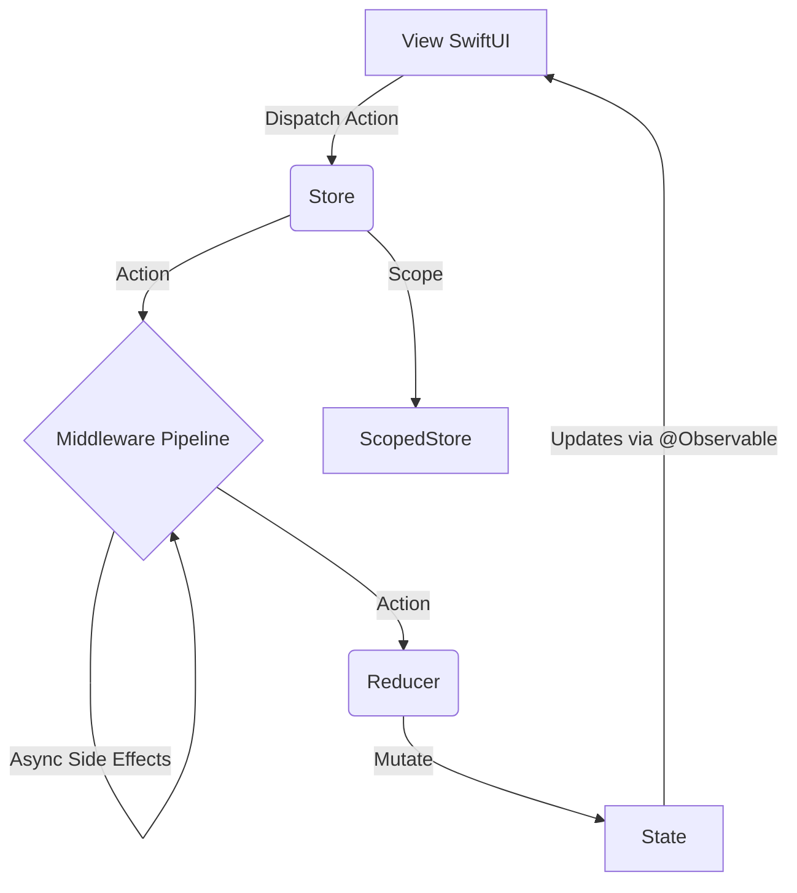

# TGReduxKit

TGReduxKit 是一个专为 SwiftUI (iOS 17+) 设计的轻量级 Redux 状态管理框架，基于 Swift Observation 提供响应式更新，并保持比 TCA 更低的心智负担。

## 架构设计



## 核心概念

- **Store**: `@MainActor` 单一数据源，持有根 State。
- **ScopedStore**: 面向 Feature 的子 Store，只暴露局部 State 和 Action。
- **Action**: 描述发生的事件。
- **Reducer**: 纯函数，`(inout State, Action) -> Void`，负责更新 State。
- **Middleware**: 运行在主线程的同步中间件，用于处理副作用入口。
- **CancellationID**: 用于取消同类异步任务的轻量标识。

## 快速开始

### 1. 定义 State 和 Action

```swift
struct AppState {
    var count: Int = 0
    var message: String = ""
}

enum AppAction {
    case increment
    case decrement
    case updateMessage(String)
}
```

### 2. 定义 Reducer

```swift
let appReducer: Reducer<AppState, AppAction> = { state, action in
    switch action {
    case .increment:
        state.count += 1
    case .decrement:
        state.count -= 1
    case .updateMessage(let msg):
        state.message = msg
    }
}
```

### 3. 创建 Middleware (可选)

```swift
let loggingMiddleware: Middleware<AppState, AppAction> = { store, action, next in
    print("Dispatched: \(action)")
    next(action)
}
```

### 4. 初始化 Store 并注入

```swift
@main
struct MyApp: App {
    @State private var store = Store(
        initialState: AppState(),
        reducer: appReducer,
        middlewares: [loggingMiddleware]
    )

    var body: some Scene {
        WindowGroup {
            ContentView()
                .provideStore(store) // 使用辅助方法注入
        }
    }
}
```

### 5. 在 View 中使用

```swift
struct ContentView: View {
    @Environment(Store<AppState, AppAction>.self) var store

    var body: some View {
        VStack {
            Text("Count: \(store.state.count)")

            HStack {
                Button("-") { store.dispatch(.decrement) }
                Button("+") { store.dispatch(.increment) }
            }

            TextField("Message", text: store.binding(
                get: \.message,
                send: { .updateMessage($0) }
            ))
        }
    }
}
```

## 高级用法

### 1. Scoped Store

```swift
struct ProfileState {
    var name = ""
}

struct AppState {
    var profile = ProfileState()
}

enum ProfileAction {
    case updateName(String)
}

enum AppAction {
    case profile(ProfileAction)
}

let profileStore = store.scope(
    state: \.profile,
    action: AppAction.profile
)
```

子视图可以只依赖 `ScopedStore<ProfileState, ProfileAction>`，避免直接耦合根状态树。

### 2. 处理异步操作

Reducer 必须保持纯净，副作用应在 **Middleware** 中处理。

```swift
enum AppAction {
    case fetchUser
    case userLoaded(String)
    case loading(Bool)
}

let apiMiddleware: Middleware<AppState, AppAction> = { store, action, next in
    next(action)

    if case .fetchUser = action {
        store.runTask(id: "fetch-user") {
            await store.dispatch(.loading(true))
            try? await Task.sleep(nanoseconds: 1_000_000_000)

            guard !Task.isCancelled else { return }

            let user = "User-" + String(Int.random(in: 1...100))
            await store.dispatch(.userLoaded(user))
            await store.dispatch(.loading(false))
        }
    }
}
```

### 3. 取消同类旧任务

```swift
store.runTask(id: "search") {
    try? await Task.sleep(nanoseconds: 300_000_000)
    guard !Task.isCancelled else { return }
    await store.dispatch(.performSearch)
}

store.cancelTask(id: "search")
```

### 4. 模块化 Reducer

随着应用变大，可以将 Reducer 拆分管理。

```swift
struct AppState {
    var counter: CounterState
    var user: UserState
}

let appReducer: Reducer<AppState, AppAction> = { state, action in
    counterReducer(&state.counter, action)
    userReducer(&state.user, action)
}
```

### 5. 调试中间件

```swift
let store = Store(
    initialState: AppState(),
    reducer: appReducer,
    middlewares: [
        actionLoggingMiddleware(),
        stateDiffMiddleware()
    ]
)
```

### 6. 与依赖注入容器协作

TGReduxKit 不需要内建 DI 容器。更合适的方式是让 Factory、Swinject、Resolver 一类容器在框架外解析依赖，再把依赖传入 middleware 工厂。

```swift
protocol UserRepository: Sendable {
    func fetchUser() async throws -> User
}

struct AppDependencies: Sendable {
    var userRepository: any UserRepository
}

func makeUserMiddleware(
    dependencies: AppDependencies
) -> Middleware<AppState, AppAction> {
    { store, action, next in
        next(action)

        guard case .loadUser = action else { return }

        store.runTask(id: "load-user") {
            guard let user = try? await dependencies.userRepository.fetchUser() else {
                return
            }

            await store.dispatch(.userLoaded(user))
        }
    }
}

let dependencies = AppDependencies(
    userRepository: container.userRepository()
)

let store = Store(
    initialState: AppState(),
    reducer: appReducer,
    middlewares: [
        makeUserMiddleware(dependencies: dependencies)
    ]
)
```

这种模式把职责分得很清楚：

- TGReduxKit 负责状态流、作用域和副作用生命周期。
- DI 容器负责解析 service、repository、client。
- View 和 reducer 不直接依赖具体容器实现。

### 7. 与 Feature Flag 库协作

Feature Flag 更适合作为依赖源，而不是 Store 内建能力。推荐做法是由 Feature Flag SDK 或封装服务提供 flag 快照，再通过 middleware 或应用启动流程把结果转换成普通 action。

```swift
protocol FeatureFlagServicing: Sendable {
    func boolValue(for key: String) async -> Bool
}

struct AppState {
    var flags = FlagsState()
}

struct FlagsState {
    var isNewCheckoutEnabled = false
}

enum AppAction {
    case appLaunched
    case flagsLoaded(isNewCheckoutEnabled: Bool)
}

func makeFeatureFlagMiddleware(
    featureFlags: any FeatureFlagServicing
) -> Middleware<AppState, AppAction> {
    { store, action, next in
        next(action)

        guard case .appLaunched = action else { return }

        store.runTask(id: "load-feature-flags") {
            let isNewCheckoutEnabled = await featureFlags.boolValue(for: "new_checkout")
            await store.dispatch(
                .flagsLoaded(isNewCheckoutEnabled: isNewCheckoutEnabled)
            )
        }
    }
}
```

推荐的职责边界：

- Feature Flag 库负责远端拉取、缓存和分流规则。
- TGReduxKit 负责把 flag 结果转换成可追踪的状态与 action。
- 配置看板类 View 可以读取 `FeatureFlagsState`，业务 View 更推荐读取 reducer 映射后的派生展示状态。
- Demo 中的完整落地方案见 `TGREDUXKIT_FEATUREFLAG_DEMO_GUIDE.md`。

常见结合方式：

- **启动期预加载**：App 启动后拉取 flag，驱动首页模块开关。
- **按模块注入**：把某个 feature 的 flag service 注入对应 middleware builder。
- **实验治理**：将实验分组结果写入 state，配合 analytics middleware 统一上报。
- **降级保护**：远端关闭某个高风险功能时，通过 action 立即收敛到稳定 UI。

## 最佳实践

1. **State 设计**: 根状态只承担聚合职责，Feature 细节通过 scoped store 暴露。
2. **Action 命名**: 描述“发生了什么”，不要描述“打算怎么做”。
3. **Reducer 约束**: reducer 只做状态变换，不做网络请求、日志和任务启动。
4. **并发策略**: 所有状态读写和 dispatch 都收敛到 `@MainActor`。
5. **异步控制**: 同类任务优先使用 `CancellationID` 管理取消。
6. **依赖注入边界**: 不把 DI 容器塞进 Store，优先注入协议化依赖或 middleware builder 参数。
7. **Feature Flag 边界**: 让 flag SDK 留在基础设施层，把 flag 结果映射为显式状态，而不是在 View 中直接查询。

## 文档生成

本项目包含完整的 API 文档注释。你可以使用 Swift-DocC 生成文档。

### 在 Xcode 中查看
在 Xcode 中打开 Package，选择 `Product` -> `Build Documentation`。

### 命令行生成
```bash
swift package generate-documentation --target TGReduxKit
```

生成的文档通常位于 `.build/plugins/Swift-DocC/outputs` 目录下（具体取决于 Swift 版本和平台）。
